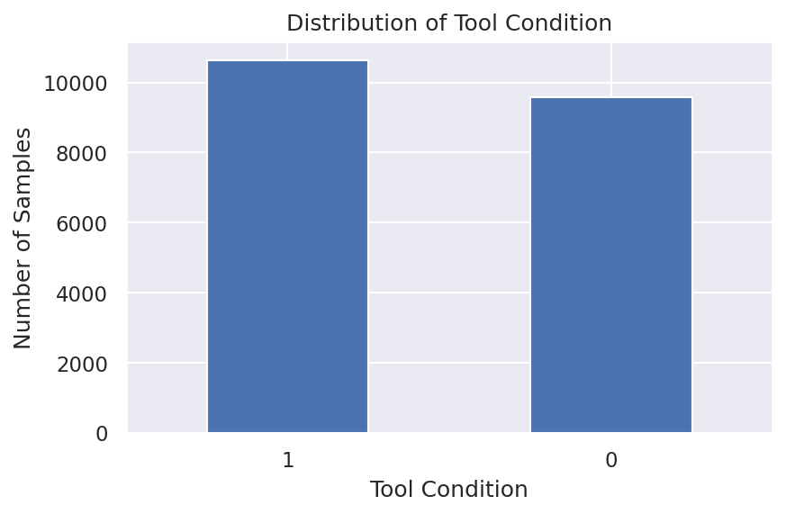
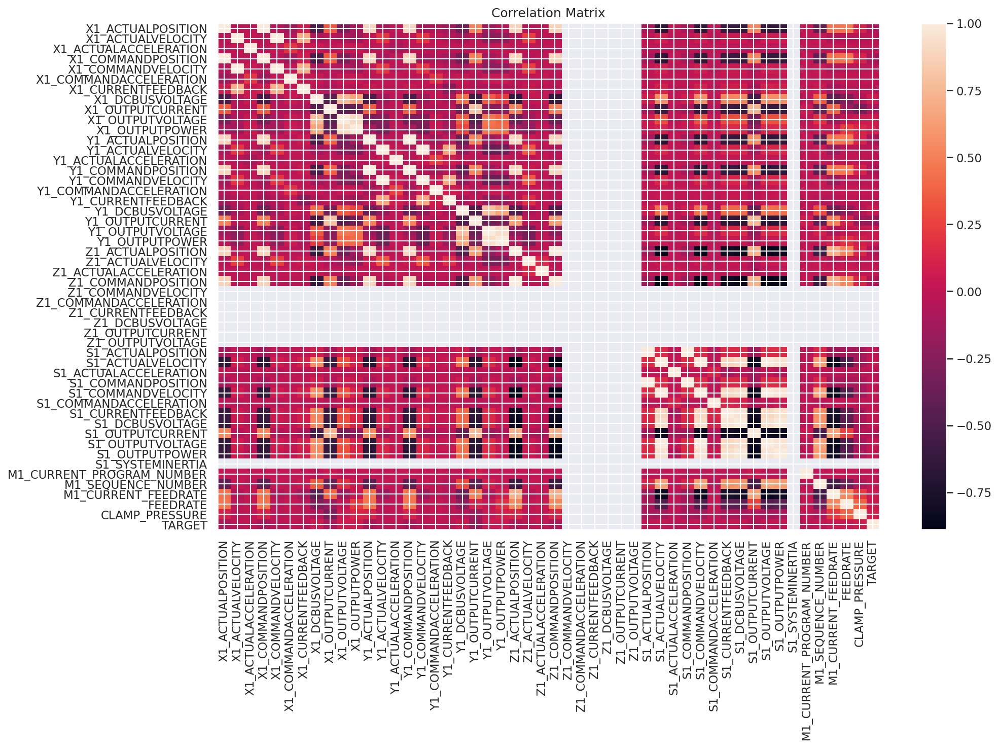
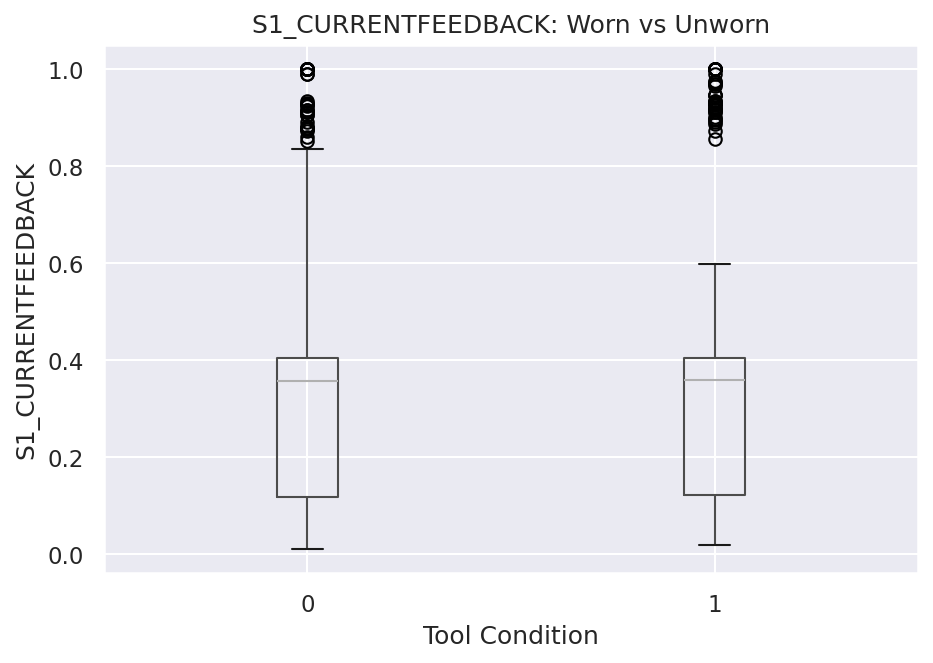
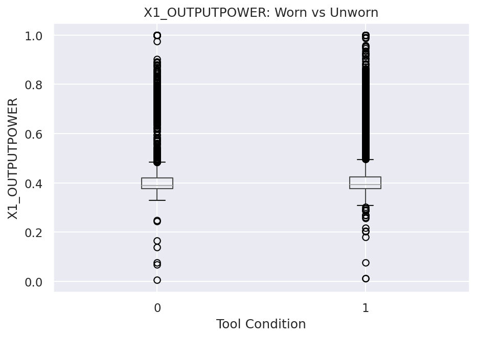

<div align="center">

# 🛠️ CNC Tool Wear Detection

**Predicting cutting-tool wear on a CNC milling machine from real-time sensor telemetry**

[](https://www.python.org/)
[](https://scikit-learn.org/)
[](https://xgboost.readthedocs.io/)
[](LICENSE)

</div>

---

## 📋 Table of Contents

- [Overview](#-overview)
- [Problem Statement](#-problem-statement)
- [Dataset](#-dataset)
- [Methodology](#-methodology)
- [Exploratory Data Analysis](#-exploratory-data-analysis)
- [Feature Engineering](#-feature-engineering)
- [Modelling](#-modelling)
- [Results](#-results)
- [Repository Structure](#-repository-structure)
- [Getting Started](#-getting-started)
- [Roadmap](#-roadmap)
- [Tech Stack](#-tech-stack)
- [Reference](#-reference)
- [License](#-license)
- [Author](#-author)

---

## 📖 Overview

CNC (Computer Numerical Control) milling tools degrade with use, and a worn tool directly affects part quality, dimensional accuracy, and surface finish. Detecting wear early — ideally from the machine's own control signals rather than manual inspection — can reduce scrap, prevent damage to the workpiece, and cut unplanned downtime.

This project trains machine learning classifiers to predict whether a CNC mill's cutting tool is **worn** or **unworn**, using only the numeric signals already logged by the machine controller (axis position, velocity, acceleration, current, voltage, power) — no additional sensors required.

## 🎯 Problem Statement

> Given the time-series control signals recorded during a single machining pass, can we classify the tool used in that pass as **worn** or **unworn**?

This is framed as a **binary classification** problem over per-timestep sensor readings, using labels collected at the experiment level (each of 18 machining experiments has one ground-truth tool condition, shared across all of that experiment's readings).

## 📊 Dataset

**Source:** [Tool Wear Detection in CNC Mill](https://www.kaggle.com/datasets/shasun/tool-wear-detection-in-cnc-mill) (Kaggle), produced by the System-level Manufacturing and Automation Research Testbed (SMART) at the University of Michigan.

The dataset covers 18 experiments milling a wax workpiece under varying feed rate and clamp pressure settings.

**`train.csv`** — one row per experiment:

| Column | Description |
|---|---|
| `No` | Experiment number |
| `material` | Workpiece material (wax) |
| `feedrate` | Relative velocity of the cutting tool along the workpiece (mm/s) |
| `clamp_pressure` | Pressure used to hold the workpiece in the vise (bar) |
| `tool_condition` | **Target label** — `worn` / `unworn` |
| `machining_finalized` | Whether machining completed without the workpiece shifting out of the vise |
| `passed_visual_inspection` | Visual inspection result (only populated when machining finished) |

**`experiment_01.csv` … `experiment_18.csv`** — one file per experiment, logging the time-series controller signal for that pass:

| Signal group | Channels |
|---|---|
| `X1_ / Y1_ / Z1_` (axis servos) | Actual & command position, velocity, acceleration, current feedback, DC bus voltage, output current/voltage/power |
| `S1_` (spindle) | Actual & command position/velocity/acceleration, current feedback, DC bus voltage, output current/voltage/power, system inertia |
| `M1_` (controller) | Current program number, sequence number, current feedrate |
| `Machining_Process` | Categorical stage label (`Starting`, `Prep`, `Layer 1 Up`, `End`, …) |

All 18 experiment files are required for the combination step (`range(1, 19)` in the notebook).

**Combined dataset:** 18 experiments → **25,286 rows × 52 columns** after merging with labels.

## 🔬 Methodology

The notebook runs end-to-end through five stages:

```
train.csv + experiment_01..18.csv
        │
        ▼
 1. Data Combination  ──▶  aggregated.csv
        │
        ▼
 2. Exploratory Data Analysis (EDA)
        │
        ▼
 3. Cleaning Decisions  (drop constant/redundant cols, encode target)
        │
        ▼
 4. Feature Engineering  ──▶  aggregated_cleaned.csv
        │                     aggregated_train_cleaned.csv / aggregated_test_cleaned.csv
        ▼
 5. Modelling  ──▶  models/*.pkl
```

### 1. Data Combination
- Load `train.csv` and all 18 `experiment_XX.csv` files.
- Fill missing `passed_visual_inspection` values with `'no'`.
- Attach `feedrate`, `clamp_pressure`, and a derived `target` (`worn`/`unworn`) to every row of each experiment from the matching `train.csv` record.
- Concatenate all experiments and save as `aggregated.csv`.

### 3. Cleaning Decisions
- Uppercase all column names.
- Drop `EXP_NO` — a cardinal ID that would let a model memorize the experiment instead of learning from sensor signal.
- Encode `TARGET` to binary: `1 = worn`, `0 = unworn`.
- Convert `FEEDRATE` / `CLAMP_PRESSURE` to numeric.
- Candidate drop columns identified from the unique-value analysis (near-constant or misleading):

  ```
  MACHINING_PROCESS, Z1_CURRENTFEEDBACK, Z1_DCBUSVOLTAGE, Z1_OUTPUTCURRENT,
  Z1_OUTPUTVOLTAGE, S1_COMMANDACCELERATION, S1_SYSTEMINERTIA,
  M1_CURRENT_PROGRAM_NUMBER, M1_SEQUENCE_NUMBER, M1_CURRENT_FEEDRATE
  ```

- Candidate drop columns from correlation analysis (|r| > 0.95):

  ```
  X1_COMMANDPOSITION, X1_COMMANDVELOCITY, Y1_COMMANDPOSITION, Y1_COMMANDVELOCITY,
  Z1_COMMANDPOSITION, S1_COMMANDPOSITION, S1_COMMANDVELOCITY, S1_DCBUSVOLTAGE,
  S1_OUTPUTVOLTAGE, S1_OUTPUTPOWER
  ```

## 📈 Exploratory Data Analysis

Custom helper functions drive the EDA:

| Function | Purpose |
|---|---|
| `check_df()` | Shape, dtypes, head/tail, NA counts, quantiles |
| `grap_column_names()` | Splits columns into categorical / numeric / categorical-but-cardinal |
| `cat_summary()` | Frequency table for a categorical column |
| `numerical_col_summary()` | Distribution summary for a numeric column |
| `target_summary_with_cat()` | Target rate by categorical feature |
| `target_summary_with_num()` | Target mean/median by numeric feature |
| `outlier_thresholds()` / `check_outlier()` | IQR-based outlier detection (5th/95th percentile bounds) |
| `high_correlated_cols()` | Flags feature pairs with correlation above a threshold |

Key visuals (in [`images/`](images/) — 50 plots total: target distribution, full correlation matrix, and a worn-vs-unworn boxplot for every numeric feature):

| Target distribution | Correlation matrix |
|---|---|
|  |  |

**Worn vs. unworn — example features:**

| Spindle current feedback | X-axis output power |
|---|---|
|  |  |

The full set of 48 per-feature boxplots is available in [`images/`](images/) for closer inspection.

## 🧪 Feature Engineering

- Re-derive categorical vs. numeric columns.
- One-hot encode remaining categorical columns (`drop_first=True`).
- Min-max scale all numeric columns.
- Save `aggregated_cleaned.csv`.
- Shuffle and split 80/20 into `aggregated_train_cleaned.csv` / `aggregated_test_cleaned.csv`.

## 🤖 Modelling

| Algorithm | Library |
|---|---|
| Random Forest | scikit-learn |
| XGBoost | xgboost |
| CatBoost | catboost |
| Voting Classifier (ensemble) | scikit-learn |

- `X`/`y` split on `TARGET`; `train_test_split` 80/20, stratified.
- `base_models()` cross-validates candidate estimators and reports ROC-AUC / accuracy via `cross_validate`.
- Best-performing estimators are saved with `joblib` to `models/` (`rf_model.pkl`, `xgboost_model.pkl`, `voting_clf.pkl`).

## 🏆 Results

> Fill in after running the hyperparameter-tuned models — see [Roadmap](#-roadmap).

| Model | Accuracy | ROC-AUC | F1 | Precision | Recall |
|---|---|---|---|---|---|
| Random Forest |  0.9912 | 0.9998 | 0.9916 |  0.9933 | 0.9929 |
| XGBoost | 0.9947 | 0.9998 | 0.9950 | 0.9953 | 0.9953  |
| Voting Ensemble | 0.9945 | 0.9998 | 0.9947 |    0.9953  |   0.9953 |

**Confusion Matrix (best model):**

```
[add plot from ConfusionMatrixDisplay, saved to images/confusion_matrix.png]
```

## 📁 Repository Structure

```
.
├── CNC1.ipynb                       # main notebook: combine → EDA → feature engineering → modelling
├── train.csv                        # experiment labels
├── experiment_01.csv … experiment_18.csv   # per-experiment sensor logs
├── images/                          # generated: EDA & result plots
├── models/                          # generated: saved .pkl models
├── aggregated.csv                   # generated: all experiments combined
├── aggregated_cleaned.csv           # generated: encoded + scaled
├── aggregated_train_cleaned.csv     # generated: 80% split
├── aggregated_test_cleaned.csv      # generated: 20% split
├── requirements.txt
├── LICENSE
└── README.md
```

## 🚀 Getting Started

### Prerequisites
- Python 3.9+
- `pip`

### Installation

```bash
git clone https://github.com/MAAykanat/CNC-Tool-Wear-Detection.git
cd CNC-Tool-Wear-Detection
pip install -r requirements.txt
```

### Requirements

```
numpy
pandas
seaborn
matplotlib
scikit-learn
xgboost
catboost
joblib
```

### Usage

1. Place `train.csv` and `experiment_01.csv` – `experiment_18.csv` in the project root (already included in this repo).
2. Open `CNC1.ipynb` and run all cells top to bottom — each stage reads the file the previous stage wrote, so order matters.
3. Generated plots land in `images/`, trained models in `models/`.

## 🗺️ Roadmap

- [ ] Wire up hyperparameter search (`GridSearchCV`/`RandomizedSearchCV`) for each estimator and populate `best_models`
- [ ] Build the `VotingClassifier` over tuned models before the `joblib.dump` step
- [ ] Decide on and apply the final drop list (constant/redundant columns) consistently
- [ ] Add a held-out test-set evaluation with confusion matrix and classification report
- [ ] Split the notebook into standalone scripts (`combine_dataset.py`, `train_model.py`) for reuse outside Jupyter
- [ ] Add unit tests for the EDA/feature-engineering helper functions

## 🧰 Tech Stack

`Python` · `pandas` · `NumPy` · `scikit-learn` · `XGBoost` · `CatBoost` · `Matplotlib` · `Seaborn` · `joblib`

## 📚 Reference

Dataset: Bergs, T. et al., *System-level Manufacturing and Automation Research Testbed (SMART)*, University of Michigan — [Tool Wear Detection in CNC Mill](https://www.kaggle.com/datasets/shasun/tool-wear-detection-in-cnc-mill).

## 📄 License

This project is licensed under the [MIT License](LICENSE).

